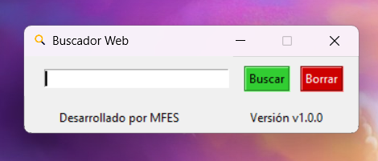

# Buscador Web en Python
## Descripción
Este programa está diseñado para abrir tu navegador y realizar búsquedas en internet. La ventaja de esta herramienta es que puedes crear abreviaciones a tus sitios web preferidos.

## Uso
Siga los pasos para utilizar la herramienta:
- **Paso 1:** Abra el archivo ejecutable **Buscador_Web-ByMFES_v1.0.0.exe**
- **Paso 2:** Haga clic en el cuadro de entrada de texto para **digitar su búsqueda**. Puede buscar escribiendo las abreviaciones previamente configuradas o sino el buscador intentará hacer la búsqueda en Google.
- **Paso 3:** Haz clic en el botón **Buscar** o presiona la tecla **Enter** para realizar tu búsqueda.

## Versión de Buscador Web
Buscador Web `v1.0.0`

## Screenshots


## Librerías
Usa las librerías **"os"**, **"tkinter"** y **"webbrowser"** que ya vienen instaladas con python.
```python
import os
import tkinter
import webbrowser
```

## Versión de Python
Hecho en `Python v3.11.3`